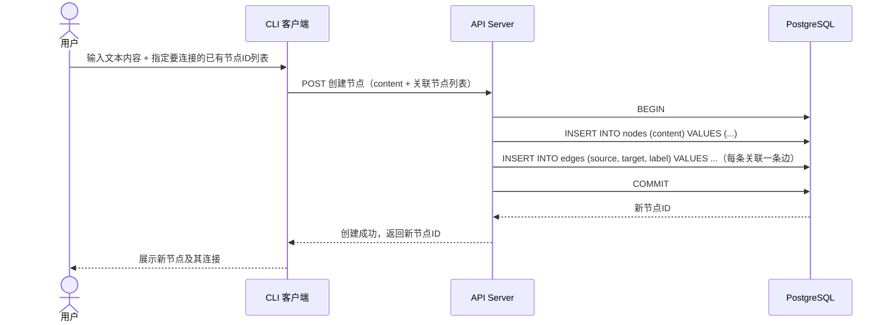
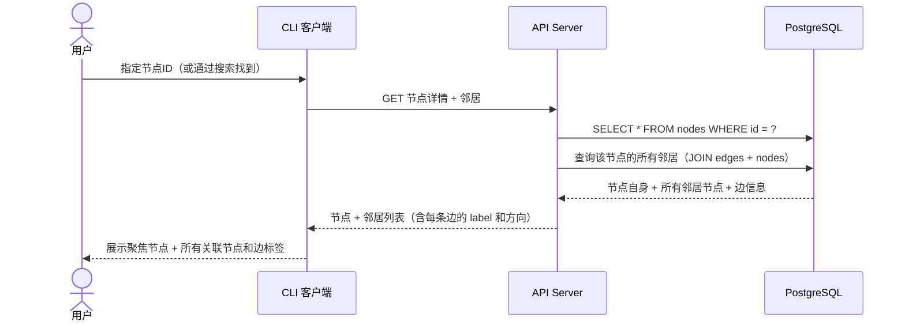
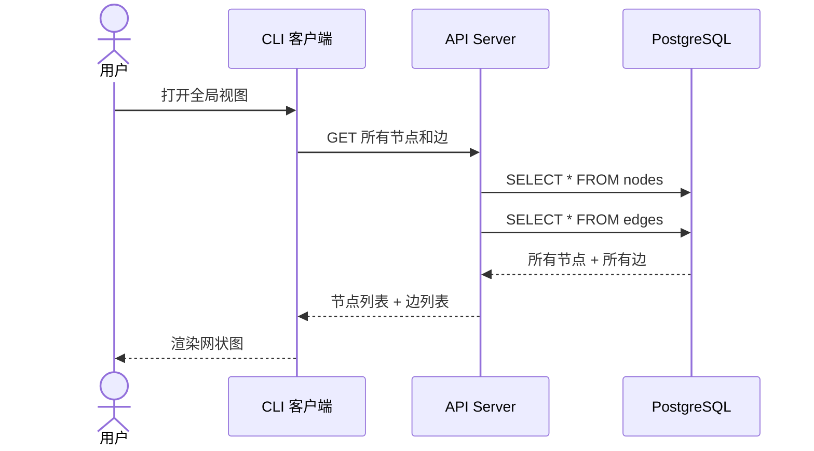

# Phase 1 场景数据流

> 对 S1、S7、S6 三个场景，分别画出数据流图（Mermaid 序列图），然后用文字描述每一步的数据流向。

## S1 · 知识录入与连接

用户输入一段文本，指定连接到哪些已有节点，系统保存。

**数据流拆解：**

1. **输入**：一段文本（content）+ 一个已有节点的 ID 列表
2. **处理**：在一个事务中，创建新节点 + 为每个关联节点创建从新节点指向已有节点的边
3. **输出**：新创建的节点 ID
4. **数据去向**：`nodes` 表新增一行，`edges` 表每个关联新增一行

**注**：边的方向在这个场景中是新节点 → 已有节点。"创建时指定连接"是 S1 最原子化的形态。未来 S3（AI 对话节点化）和 S5（课程自动采集）会是这个操作的批量/自动化变体。

---

## S7 · 聚焦式节点探索

用户选中一个节点，查看它连接了哪些其他节点。

**数据流拆解：**

1. **输入**：目标节点的 ID
2. **处理**：查节点自身 + 查所有以该节点为 source 或 target 的边 + 查这些边的另一端节点
3. **输出**：目标节点内容 + 所有邻居节点（含边 label 和方向）
4. **数据读取**：1 次读 `nodes`，1 次 JOIN 读 `edges` + `nodes`

**注**：这是最核心的读操作。没有分页、没有深度遍历、不做递归——只查一层邻居。更深的遍历是 L2 的事。

---

## S6 · 知识图谱导航与定位

用户打开全局视图，看到所有节点和边的网状概览。

**数据流拆解：**

1. **输入**：无（或可选的过滤条件）
2. **处理**：全量读取 nodes 和 edges
3. **输出**：完整的两张表数据，供前端渲染
4. **数据读取**：2 次全表查询

**注**：Phase 1 不设分页——数据量还小的时候全量加载即可。这个设计在 Phase 2 数据量增大后可能需要改为增量/分页/空间索引方案，届时 L2 提出新 ADR supersede 本决策。
