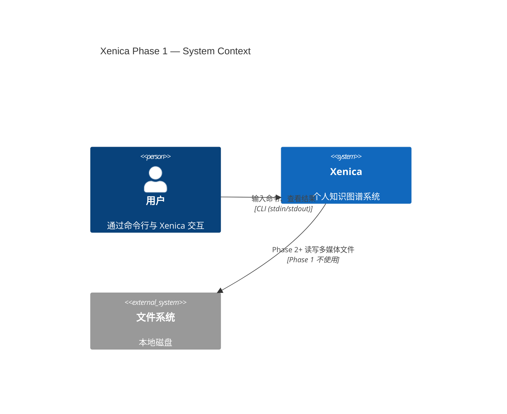
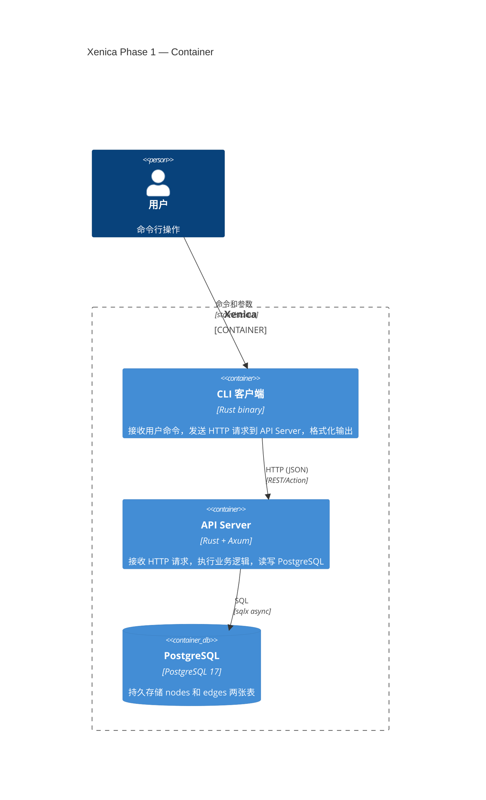

# L1 架构图

> C4 model — System Context + Container 层。不画组件内部和代码层级。

## System Context（系统上下文）

Xenica 在 Phase 1 只有一种用户、一个外部系统边界。



## Container（容器层）

Phase 1 只有两个运行时容器：API Server 和 PostgreSQL。CLI 客户端不是独立容器——它在用户的终端里直接运行，调用 API。



## 数据流方向

```
用户 → CLI → [HTTP] → API Server → [SQL] → PostgreSQL
                                    ↑
                              同步请求-响应
                              没有消息队列
                              没有异步 worker
```

## 不在图中的

| 排除项                         | 原因                   |
| --------------------------- | -------------------- |
| 消息队列 / worker               | Phase 1 没有异步任务       |
| 前端                          | defer，Phase 1 只用 CLI |
| 文件存储                        | Phase 1 只存文本，不处理多媒体  |
| pgvector / zhparser 等 PG 扩展 | Phase 2+ 按需引入        |
| Nginx / 反向代理                | Phase 1 单机本地运行，不需要   |

## 对应 ADR

- 数据模型 → [data-model.md](data-model.md)
- API 设计 + 同步架构 → [api-design.md](api-design.md)
- 技术栈 → [tech-stack.md](tech-stack.md)
